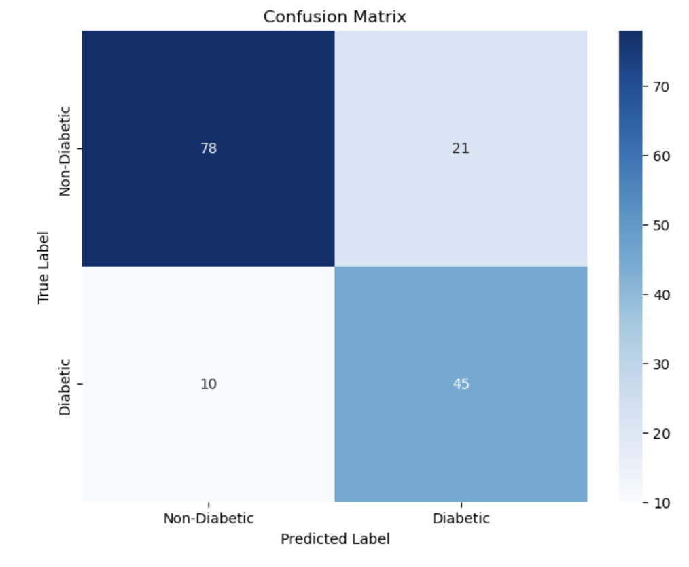
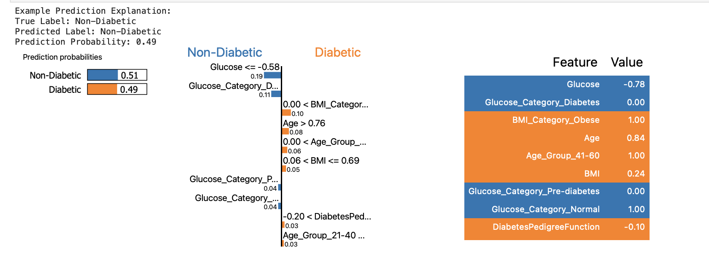

# Emerging Topics in AI — Mini Project

Academic mini-project on a classic ML workflow with **model training**, **evaluation**, and **explainability** (SHAP & LIME) using the Pima Indians Diabetes dataset.

---

## Overview

- **Dataset:** [Pima Indians Diabetes (Kaggle)](https://www.kaggle.com/datasets/saurabh00007/diabetescsv)  
  Small, tabular, binary classification dataset (`Outcome` = diabetes yes/no).
- **Model:** Random Forest Classifier (+ class balancing with **SMOTE** from `imbalanced-learn`).
- **Evaluation:** Accuracy, ROC-AUC, confusion matrix, classification report, cross-validation.
- **Explainability:** **SHAP** (global feature importance) and **LIME** (local instance explanations).

---

## Notebooks

- `notebooks/Emerging Topics AI.ipynb`  
  End-to-end pipeline: data loading, cleaning, scaling, training, SMOTE, evaluation, SHAP & LIME.

---

## Data

### Option A — Quick (recommended)
1. Download **`diabetes.csv`** from Kaggle:  
   https://www.kaggle.com/datasets/saurabh00007/diabetescsv
2. Place the file into the project’s `data/` folder:  
   `data/diabetes.csv`

> If your notebook expects a different path, update the path in the first data-loading cell.

### Option B — Kaggle API (optional)
If you prefer the Kaggle API:
```bash
pip install kaggle
# Place your kaggle.json API token in ~/.kaggle/kaggle.json (Linux/Mac) or %USERPROFILE%\.kaggle\kaggle.json (Windows)
kaggle datasets download -d saurabh00007/diabetescsv -p data/ --unzip
# Result: data/diabetes.csv
```

---

## How to Run

```bash
# 1) Clone
git clone https://github.com/<YOUR_USERNAME>/emerging-topics-ai.git
cd emerging-topics-ai

# 2) (Optional) Create and activate a virtual environment
# python -m venv .venv && source .venv/bin/activate   # Linux/Mac
# .venv\Scripts\activate                               # Windows

# 3) Install dependencies
pip install -r requirements.txt

# 4) Launch Jupyter
jupyter notebook
# Open notebooks/Emerging Topics AI.ipynb and run all cells
```

---

## Results (examples)

Export plots from the notebook to `results/` and reference them here:

- Confusion matrix – `results/confusion_matrix.png`  
- ROC curve – `results/roc_curve.png`  
- SHAP summary – `results/shap_summary.png`  
- LIME explanation – `results/lime_example.png`

```html
<p align="center">
  
  
</p>
<p align="center">
  
  
</p>
```

*(Images will display once you add them to the `results/` folder.)*

---

## Repository Structure

```
emerging-topics-ai/
├─ notebooks/
│  └─ Emerging Topics AI.ipynb
├─ data/
│  └─ diabetes.csv                 # downloaded from Kaggle
├─ results/
│  └─ (plots exported from notebook)
├─ requirements.txt
└─ README.md
```

---

## Acknowledgment

Dataset: **Pima Indians Diabetes** — © original authors / Kaggle host  
https://www.kaggle.com/datasets/saurabh00007/diabetescsv

---

## License

MIT — feel free to use and adapt with attribution.
