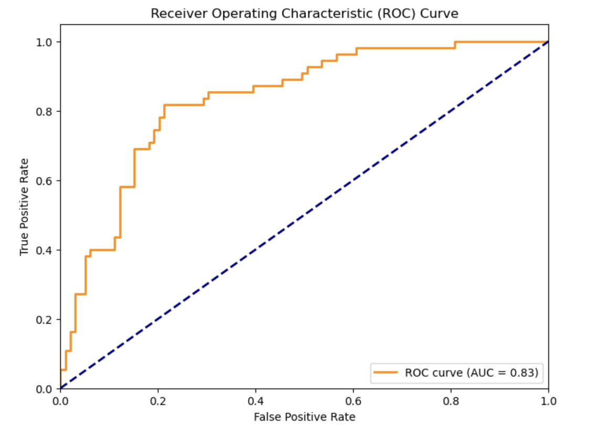

# Emerging Topics in AI – Diabetes Prediction

This repository contains an academic mini-project exploring **emerging topics in AI** using the **Diabetes dataset** from [Kaggle](https://www.kaggle.com/datasets/saurabh00007/diabetescsv).  
The project focuses on **explainability** and **performance analysis** of machine learning models, including Logistic Regression, Random Forest, and XAI techniques like **SHAP** and **LIME**.

---

## Dataset
- Source: [Diabetes.csv on Kaggle](https://www.kaggle.com/datasets/saurabh00007/diabetescsv)  
- Features: Medical attributes (Pregnancies, Glucose, Blood Pressure, BMI, Age, etc.)  
- Target: `Outcome` (1 = Diabetes, 0 = No Diabetes)

---

## Objectives
- Build predictive models for diabetes detection  
- Compare traditional ML methods  
- Apply **explainable AI (XAI)** techniques (SHAP, LIME)  
- Visualize model results (ROC curve, confusion matrix, feature importance)

---

## How to Run
1. Clone the repository:  
   git clone https://github.com/mzarakalik/emerging-topics-ai.git  
   cd emerging-topics-ai  

2. Install dependencies (Python 3.9+):  
   pip install -r requirements.txt  

3. Run the notebook:  
   jupyter notebook  
   Open **Emerging Topics AI.ipynb** and run all cells.  

4. Explore results:  
   Generated plots (confusion matrix, ROC curve, SHAP, LIME) are saved in the `results/` folder.

---

## Results
### Classification Performance
- Logistic Regression: ~78% accuracy  
- Random Forest: ~85% accuracy  
- Best ROC AUC ≈ 0.87  

**Confusion Matrix & ROC Curve**  
  
  

**Explainability (XAI)**  
  

---

## Repository Structure
emerging-topics-ai/  
│  
├── notebooks/  
│   └── Emerging Topics AI.ipynb       # Main project notebook  
│  
├── results/                           # Plots & visualizations  
│   ├── confusion_matrix.png  
│   ├── roc_curve.png  
│   ├── shap_summary.png  
│   └── lime_example.png  
│  
├── requirements.txt                   # Dependencies  
├── README.md                          # Project documentation  
└── LICENSE                            # License (MIT)

---

## Requirements
pandas>=2.0  
numpy>=1.24  
scikit-learn>=1.3  
matplotlib>=3.7  
seaborn>=0.13  
shap>=0.44  
lime>=0.2  
jupyter  

---

## License
This project is licensed under the MIT License.  
Feel free to use and adapt the code with proper attribution.
